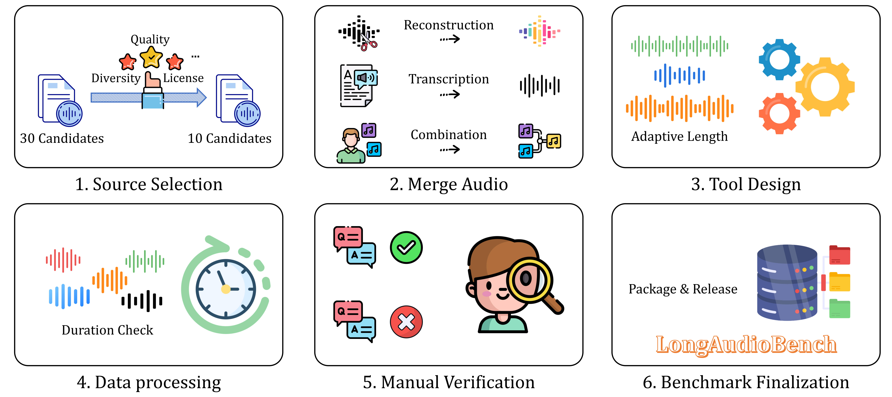

# AudioMarathon: Long-Form Audio Understanding Benchmark

## 👥 Authors

**Peize He**<sup>1*</sup>, **Zichen Wen**<sup>1,2*</sup>, **Yubo Wang**<sup>1*</sup>, **Yuxuan Wang**<sup>1</sup>, **Xiaoqian Liu**<sup>1,3</sup>, **Jiajie Huang**<sup>1</sup>, **Zehui Lei**<sup>1</sup>, **Zhuangcheng Gu**<sup>4</sup>, **Xiangqi Jin**<sup>1</sup>, **Jiabing Yang**<sup>5</sup>, **Kai Li**<sup>6</sup>, **Zhifei Liu**<sup>1</sup>, **Weijia Li**<sup>7,2</sup>, **Cunxiang Wang**<sup>6</sup>, **Conghui He**<sup>2</sup>, **Linfeng Zhang**<sup>1†</sup>

<sup>1</sup>Shanghai Jiao Tong University  
<sup>2</sup>Shanghai AI Laboratory  
<sup>3</sup>Northeastern University  
<sup>4</sup>Carnegie Mellon University  
<sup>5</sup>University of Chinese Academy of Sciences  
<sup>6</sup>Tsinghua University  
<sup>7</sup>Sun Yat-sen University

<sup>*</sup>Equal contribution  
<sup>†</sup>Corresponding author

---

## 📑 Table of Contents

- [📖 Overview](#-overview)
- [🎪 Supported Tasks](#-supported-tasks)
- [🔗 Pipeline](#pipeline)
- [🏆 Leader Board](#leader-board) 🌟
- [📊 Visible Results](#visible-results) 🌟
- [🏗️ Repository Structure](#️-repository-structure)
- [🚀 Quick Start](#-quick-start)
- [⚙️ Configuration](#️-configuration)
- [📈 Performance Analysis](#-performance-analysis)
- [🛠️ Utility Tools](#️-utility-tools)
- [📝 Data Preparation](#-data-preparation)
- [📄 Citation](#-citation)
- [📧 Contact](#-contact)
- [🙏 Acknowledgments](#-acknowledgments)
- [📜 License](#-license)

**Quick Links:** 
[🏆 View Leader Board](#leader-board) | [📊 View Results](#visible-results) | [🚀 Get Started](#-quick-start) 

---

## 📖 Overview

**AudioMarathon** is a comprehensive benchmark designed to evaluate Audio Large Language Models (Audio-LLMs) on long-form audio understanding tasks. This repository contains the evaluation code and tools for testing various state-of-the-art audio-language models across multiple challenging tasks.

<div align="center">
  
</div>

### Key Features

- 🎯 **Multi-Task Evaluation**: Supports 10+ diverse audio understanding tasks
- 🔊 **Long-Form Audio**: Handles extended audio sequences up to several minutes
- 🧠 **Multiple Models**: Evaluation scripts for Phi-4-MM, Qwen2.5-Omni, and Aero-1.
- ⚡ **Audio Token Pruning**: Built-in support for various KV-cache compression methods
- 📊 **Comprehensive Metrics**: Detailed performance analysis with timing statistics

## 🎪 Supported Tasks

AudioMarathon evaluates models across the following task categories with 6,563 samples:

### Speech Content Extraction (1,514 samples - 23.07%)

| Task | Dataset | Samples | Description |
|------|---------|---------|-------------|
| **Automatic Speech Recognition (ASR)** | LibriSpeech | 204 (3.10%) | Transcribe and understand spoken content |
| **Speech Content Reasoning (SCR)** | RACE | 820 (12.49%) | Answer questions based on read-aloud passages |
| **Speech Entity Recognition (SER)** | SLUE | 490 (7.46%) | Recognize and extract entities from spoken language |

### Audio Classification (1,519 samples - 23.14%)

| Task | Dataset | Samples | Description |
|------|---------|---------|-------------|
| **Audio Scene Classifier (ASC)** | TAU | 1,145 (17.44%) | Classify acoustic scenes (indoor/outdoor environments) |
| **Music Classifier (MC)** | GTZAN | 120 (1.83%) | Classify music genres from audio clips |
| **Sound Event Detection (SED)** | DESED | 254 (3.87%) | Detect and classify sound events in domestic environments |

### Speaker Recognition (3,530 samples - 53.79%)

| Task | Dataset | Samples | Description |
|------|---------|---------|-------------|
| **Emotion Recognition (ER)** | VESUS | 185 (2.82%) | Recognize emotions from speech |
| **Speech Detection (SD)** | HAD | 776 (11.82%) | Distinguish between real and AI-generated speech |
| **Speaker Age Recognition (SAR)** | VoxCeleb | 959 (14.60%) | Classify speaker age groups from voice |
| **Speaker Gender Recognition (SGR)** | VoxCeleb | 1,614 (24.58%) | Classify speaker gender from voice |

## Pipeline
### Data Consturction Pipeline
<div align="center">
  
</div>

## 🏗️ Repository Structure

```
AudioMarathon/
├── Phi4MM/
│   ├── DART/                    # DART (Dynamic Audio Reduction Technique) implementations
│   ├── Others/                  # Standard evaluation scripts for Phi-4-MM
│   │   ├── DESED_test.py       # Sound event detection evaluation
│   │   ├── gtzan_test.py       # Music genre classification
│   │   ├── HAD_test.py         # Audio deepfake detection
│   │   ├── race_test.py        # Reading comprehension
│   │   ├── SLUE_test.py        # Spoken language understanding
│   │   ├── TAU_test.py         # Acoustic scene classification
│   │   ├── VESUS_test.py       # Emotion recognition
│   │   ├── Vox_age_test.py     # Age classification
│   │   └── Vox_test.py         # Gender classification
│   └── phi4_kvpress/            # KV-cache compression methods
│
├── Qwen_2.5_Omni/
│   ├── Dart/                    # DART implementations for Qwen
│   ├── Others/                  # Standard evaluation scripts for Qwen2.5-Omni
│   └── qwen_kvpress/            # KV-cache compression methods
│
├── Voxtral/
│   ├── eval_DESED.py           # Voxtral evaluation scripts
│   ├── eval_GTZAN.py
│   ├── eval_HAD.py
│   ├── eval_LibriSpeech.py
│   ├── eval_RACE.py
│   ├── eval_SLUE.py
│   ├── eval_TAU.py
│   ├── eval_VESUS.py
│   ├── eval_Vox_Age.py
│   └── eval_Vox.py
│
├── Aero-1/                      # Aero-1 model evaluation scripts
│   ├── DART/
│   └── Others/
│
├── kvpress/                     # KV-cache compression implementations
│   ├── presses/                 # Various compression strategies
│   ├── attention_patch.py
│   ├── audio_features.py
│   └── pipeline.py
│
├── Segment/                     # Audio segmentation tools
│   ├── GTZAN_task.py
│   ├── HAD_segment.py
│   ├── TAU_task.py
│   └── Vox2_task.py
│
└── analyse_audio_duration/      # Audio duration analysis utilities
```

## 🚀 Quick Start

### Installation

1. **Clone the repository**
```bash
git clone https://github.com/YourUsername/AudioMarathon.git
cd AudioMarathon
```

2. **Install dependencies**

Choose the appropriate requirements file based on the model you want to evaluate:

```bash
# For Phi-4-MM
pip install -r Phi4_requirements.txt

# For Qwen2.5-Omni
pip install -r Qwen_requirements.txt

# For Aero-1
pip install -r Aero1_requirements.txt
```

**Note**: Each model has its own environment requirements. We recommend using separate virtual environments for different models to avoid dependency conflicts.


### Basic Usage

#### Evaluate Phi-4-MM on GTZAN (Music Genre Classification)

```bash
cd Phi4MM/Others

# Basic evaluation
export CUDA_VISIBLE_DEVICES=0
export PRUNE_RATIO=0
export PRUNE_METHOD=base
export SAMPLE_LIMIT=100
export RESULTS_DIR=./GTZAN_Results

python gtzan_test.py
```

#### Evaluate with Audio Token Pruning

```bash
# Using FastV pruning with 50% compression
export CUDA_VISIBLE_DEVICES=0
export PRUNE_LAYER_IDX=2
export PRUNE_RATIO=0.5
export PRUNE_METHOD=fast_v
export RESULTS_DIR=./GTZAN_Results_FastV50

python gtzan_test.py
```

#### Batch Evaluation

For evaluating multiple sparsity ratios in a single run, use the batch testing scripts:

```bash
cd Qwen_2.5_Omni/Dart

# Basic usage - test HAD task with default ratios (0.1-0.9)
bash batch_test.sh HAD

# Test with custom GPU
bash batch_test.sh --gpu-id 1 TAU

# Test with sample limit (useful for quick testing)
bash batch_test.sh --sample-limit 100 SLUE

# Test with specific sparsity ratios
bash batch_test.sh --ratios 0.0,0.3,0.5,0.7 VESUS

# Test with custom pruned layers and output directory
bash batch_test.sh --pruned-layer 3 --output-dir ./my_results GTZAN

# Comprehensive test with all options
bash batch_test.sh \
  --gpu-id 0 \
  --sample-limit 200 \
  --pruned-layer 2 \
  --ratios 0.0,0.2,0.4,0.6,0.8 \
  --output-dir ./Qwen_DART_Results \
  race
```

**Available Options:**
- `-g, --gpu-id <id>`: Specify GPU device (default: 0)
- `-s, --sample-limit <num>`: Limit number of samples (default: 0 for no limit)
- `-l, --pruned-layer <num>`: Number of layers to prune (default: 2)
- `-r, --ratios <ratios>`: Comma-separated sparsity ratios (default: 0.1,0.2,0.3,0.4,0.5,0.6,0.7,0.8,0.9)
- `-o, --output-dir <dir>`: Results output directory (default: ./Qwen_DART_Results)
- `-h, --help`: Show help message

**Supported Tasks:**
HAD, race, SLUE, TAU, VESUS, Vox, Vox_age, LibriSpeech, DESED, GTZAN

The batch script will:
1. Automatically run tests for all specified sparsity ratios
2. Generate logs for each test in `<output-dir>/logs/`
3. Create a summary report with all results
4. Display timing statistics and accuracy metrics

## ⚙️ Configuration

### Environment Variables

All evaluation scripts support the following environment variables:

| Variable | Description | Default | Options |
|----------|-------------|---------|---------|
| `CUDA_VISIBLE_DEVICES` | GPU device ID | `0` | Any valid GPU ID |
| `PRUNE_LAYER_IDX` | Layer index for audio pruning | `2` | Integer >= 0 |
| `PRUNE_RATIO` | Ratio of audio tokens to prune | `0` | 0.0 - 1.0 |
| `PRUNE_METHOD` | Pruning method to use | `base` | `base`, `fast_v`, `random`, `frame` |
| `SAMPLE_LIMIT` | Limit number of samples | `0` (no limit) | Integer >= 0 |
| `RESULTS_DIR` | Output directory for results | Task-specific | Any valid path |

### Audio Token Pruning Methods

AudioMarathon supports multiple KV-cache compression strategies:

1. **base**: No pruning (baseline)
2. **Fast_v**: FastV attention-based pruning
3. **Random**: Random token pruning
4. **Frame**: Frame-based structured pruning
5. **DART**: Pruning tokens based on its duplication with other tokens


## 📈 Performance Analysis

### Timing Analysis

Each script tracks detailed timing metrics:
- **Prefill Time**: Time for initial audio encoding
- **Decode Time**: Time for generating responses
- **Tokens per Second**: Generation throughput
- **Audio Duration**: Input audio length

## Visible Results
### Rader Chart
<div align="center">
  
</div>


## Leader Board

### 🏆 Overall Performance Ranking

Based on average F1-scores across all 10 tasks (SER, SCR, ASR, SED, MC, ASC, SD, ER, SAR, SGR):

#### 🥇 Top Open-Source Models

| Rank | Model | Avg. Score | SER | SCR | ASR | SED | MC | ASC | SD | ER | SAR | SGR |
|:----:|-------|:----------:|:---:|:---:|:---:|:---:|:--:|:---:|:--:|:--:|:---:|:---:|
| 🥇 | **Qwen2.5-Omni-7B** | **70.5** | 26.3 | **85.1** | **98.1** | **78.4** | **100.0** | **72.2** | **72.3** | 53.4 | 21.4 | 98.0 |
| 🥈 | **Qwen2.5-Omni-3B** | **67.2** | 25.2 | 82.3 | 94.7 | 70.2 | 97.4 | 69.3 | 67.3 | 39.6 | 29.1 | 97.2 |
| 🥉 | **Audio-Flamingo-3** | **63.0** | 21.7 | 78.9 | 94.3 | 59.5 | 97.0 | 54.1 | 33.7 | **54.3** | **40.7** | 96.2 |
| 4 | Voxtral-Mini-3B-2507 | 57.4 | 24.3 | 71.1 | 96.8 | 71.0 | 83.8 | 27.2 | 68.0 | 29.7 | 30.7 | 71.0 |
| 5 | Gemma-3n-E4B-it | 49.3 | 19.0 | 56.9 | 93.2 | 50.2 | 71.9 | 31.7 | 35.9 | 18.9 | 21.8 | 93.0 |
| 6 | Phi-4-Multimodal | 47.7 | 18.4 | 69.3 | 92.7 | 55.1 | 46.7 | 23.4 | 26.4 | 27.3 | 26.6 | 91.1 |
| 7 | Gemma-3n-E2B-it | 45.5 | 22.5 | 51.6 | 91.3 | 50.2 | 56.8 | 28.2 | 35.1 | 15.2 | 12.2 | 91.6 |
| 8 | Aero-1-Audio | 42.8 | 17.9 | 56.6 | 43.7 | 55.0 | 83.9 | 39.9 | 33.7 | 32.0 | 17.8 | 47.5 |
| 9 | Baichuan-Omni-1.5 | 39.3 | 12.4 | 11.2 | 86.5 | 45.7 | 52.0 | 25.8 | 49.2 | 18.9 | 10.2 | 81.5 |
| 10 | Audio-Flamingo-2 | 35.6 | 26.8 | 39.8 | 1.0 | 27.1 | 66.8 | 29.7 | 45.9 | 13.1 | 20.3 | 85.1 |

#### 🥇 Top Closed-Source Models

| Rank | Model | Avg. Score | SER | SCR | ASR | SED | MC | ASC | SD | ER | SAR | SGR |
|:----:|-------|:----------:|:---:|:---:|:---:|:---:|:--:|:---:|:--:|:--:|:---:|:---:|
| 🥇 | **Gemini-2.5-Flash** | **59.6** | 28.1 | **83.6** | 96.8 | 69.2 | 79.3 | 40.8 | 33.1 | 31.9 | 34.3 | **99.3** |
| 🥈 | **Gemini-2.0-Flash** | **59.4** | **30.9** | 71.8 | 96.4 | 68.1 | 88.5 | **54.1** | 32.1 | 20.1 | **39.2** | 93.1 |
| 🥉 | **Gemini-2.0-Flash-Lite** | **53.1** | 23.7 | 65.6 | **97.4** | 60.9 | 86.9 | 43.4 | 34.5 | 17.3 | 19.0 | 82.1 |
| 4 | Gemini-2.5-Flash-Lite | 50.6 | 30.3 | 64.0 | 96.5 | 68.0 | 64.8 | 36.8 | 33.9 | 14.6 | 19.6 | 77.9 |
| 5 | GPT-4o-Audio (2024-12-17) | 48.7 | 25.7 | 60.2 | 94.7 | 51.2 | 67.6 | 41.9 | 30.8 | 21.8 | 19.9 | 73.1 |
| 6 | GPT-4o-Audio (2024-10-01) | 47.4 | 25.8 | 61.4 | 94.4 | 50.7 | 59.5 | 40.8 | 32.5 | 22.5 | 17.2 | 69.2 |

#### 📊 Task Abbreviations

- **SER**: Speech Entity Recognition (SLUE)
- **SCR**: Speech Content Reasoning (RACE)
- **ASR**: Automatic Speech Recognition (LibriSpeech)
- **SED**: Sound Event Detection (DESED)
- **MC**: Music Classification (GTZAN)
- **ASC**: Audio Scene Classification (TAU)
- **SD**: Speech Detection/Deepfake Detection (HAD)
- **ER**: Emotion Recognition (VESUS)
- **SAR**: Speaker Age Recognition (VoxCeleb)
- **SGR**: Speaker Gender Recognition (VoxCeleb)


### 🏅 Category Champions

| Category | Champion Model | Score | Runner-up | Score |
|----------|----------------|:-----:|-----------|:-----:|
| **Speech Content Extraction** | Gemini-2.0-Flash | 30.9 (SER) | Gemini-2.5-Flash-Lite | 30.3 |
| | Qwen2.5-Omni-7B | 85.1 (SCR) | Gemini-2.5-Flash | 83.6 |
| | Qwen2.5-Omni-7B | 98.1 (ASR) | Gemini-2.0-Flash-Lite | 97.4 |
| **Audio Classification** | Qwen2.5-Omni-7B | 78.4 (SED) | Voxtral-Mini | 71.0 |
| | Qwen2.5-Omni-7B | 100.0 (MC) | Audio-Flamingo-3 | 97.0 |
| | Qwen2.5-Omni-7B | 72.2 (ASC) | Qwen2.5-Omni-3B | 69.3 |
| **Speaker Information** | Qwen2.5-Omni-7B | 72.3 (SD) | Voxtral-Mini | 68.0 |
| | Audio-Flamingo-3 | 54.3 (ER) | Qwen2.5-Omni-7B | 53.4 |
| | Audio-Flamingo-3 | 40.7 (SAR) | Gemini-2.0-Flash | 39.2 |
| | Gemini-2.5-Flash | 99.3 (SGR) | Qwen2.5-Omni-7B | 98.0 |

## 🛠️ Utility Tools

### Audio Duration Analysis

Analyze audio lengths in your datasets:

```bash
cd analyse_audio_duration
python GTZAN.py
python HAD.py
python TAU.py
```

### Audio Segmentation

Segment long audio files for processing:

```bash
cd Segment
python GTZAN_task.py
python HAD_segment.py
python TAU_task.py
```

## 📝 Data Preparation

### Expected Data Format

Each task expects data in a specific format:

#### GTZAN (JSON metadata)
```json
[
  {
    "path": "audio/blues_001.wav",
    "question": "What is the genre of this music?",
    "choice_a": "Blues",
    "choice_b": "Classical",
    "choice_c": "Rock",
    "choice_d": "Jazz",
    "answer_gt": "A"
  }
]
```

#### HAD (Directory structure)
```
HAD/
├── real/
│   ├── audio_001.wav
│   └── audio_002.wav
└── fake/
    ├── audio_001.wav
    └── audio_002.wav
```

#### DESED (JSON with tasks)
```json
{
  "tasks": [
    {
      "path": "audio_001.wav",
      "task_type": "detection",
      "question": "What sound events are present?",
      "choices": {
        "A": "Dog barking",
        "B": "Car horn",
        "C": "Phone ringing",
        "D": "Door slamming"
      },
      "answer_gt": "C"
    }
  ]
}
```


## 📄 Citation

If you use AudioMarathon in your research, please cite:


## 📧 Contact

For questions or issues, please:
- Open an issue on GitHub
- Contact: 1006803978@qq.com

## 🙏 Acknowledgments

We thank the following for their contributions:
- Microsoft for Phi-4-Multimodal
- Qwen team for Qwen2.5-Omni
- Fixie AI for Ultravox/Voxtral
- All dataset providers (DESED, GTZAN, HAD, LibriSpeech, RACE, SLUE, TAU, VESUS, VoxCeleb)

## 📜 License

This project is licensed under the MIT License - see the [LICENSE](LICENSE) file for details.

---

**Note**: This benchmark is designed for research purposes. Please ensure you have the proper licenses and permissions for all datasets before use.
